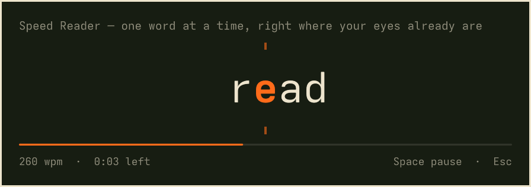

# Speed Reader



An Omarchy shell plugin that speed-reads text one word at a time in a
centered, themed card. Point it at the clipboard, highlighted text, or a
copied webpage link.

Each word is placed so its focus letter (a little left of the middle, drawn
in the theme's accent color) always lands on the same column, marked by two
small ticks. Your eyes stay still; the words come to you.

## Use

Copy some text, or a link to an article, and press **`Super+Shift+T`**.
Press it again (or `Esc`) to close.

| Key | Action |
|---|---|
| `Space` / `Enter` / click | Pause / resume (restart when finished) |
| `←` `→` or `h` `l` | Previous / next sentence |
| `↑` `↓` or `k` `j` | Faster / slower |
| `Home` | Back to the start |
| `Esc` / `q` | Close |

In `auto` mode (the default) it reads the clipboard. A clipboard that holds
just a URL is fetched and reduced to the article text. When the clipboard is
empty it falls back to the highlighted (primary) selection.

## Install

```bash
omarchy plugin add https://github.com/rmc507/omarchy-speed-reader.git --enable
```

Then add a keybinding to `~/.config/hypr/bindings.lua`:

```lua
o.bind("SUPER + SHIFT + T", "Speed read clipboard", "omarchy-shell shell toggle io.github.rmc507.speed-reader '{}'")
```

### Dependencies

- `wl-clipboard`, `curl` and `python3`, all of which ship with Omarchy.
- Optional: the [`defuddle`](https://github.com/kepano/defuddle) CLI. When it
  is on your `PATH`, webpages are cleaned with it; otherwise a built-in
  extractor keeps the page's `<article>`/`<main>` text.

The plugin only reads `~/.config/omarchy/shell.json`; it never writes to your
configuration. Webpages are downloaded as HTML and read as text, never run.

## Configure

Settings live on the plugin's entry in `~/.config/omarchy/shell.json` and
apply on save. Every key is optional:

```jsonc
"plugins": [
  {
    "id": "io.github.rmc507.speed-reader",
    "wpm": 300,               // words per minute (60–1500)
    "wpmStep": 25,            // change per ↑/↓ press
    "source": "auto",         // auto | clipboard | selection
    "extractor": "auto",      // auto | defuddle | builtin (webpages)
    "fontSize": 0,            // word size in px; 0 follows the theme
    "width": 0,               // card width in px; 0 follows the theme
    "focusPosition": 0.5,     // focus column across the card, 0.2–0.8
    "punctuationPause": 2.0,  // hold multiplier at sentence ends (half at , ; :)
    "longWordPause": 1.4,     // hold multiplier for long words
    "longWordLength": 8,      // letters before a word counts as long
    "startDelay": 800         // ms to hold the first word
  }
]
```

Speed changes made with the arrow keys last until the card is closed.

## Other ways to open it

The summon payload can override the source, so other bindings or scripts can
read something specific:

```bash
omarchy-shell shell toggle io.github.rmc507.speed-reader '{"source":"selection"}'
omarchy-shell shell toggle io.github.rmc507.speed-reader '{"url":"https://example.com/post"}'
omarchy-shell shell toggle io.github.rmc507.speed-reader '{"file":"~/Books/novel.epub"}'
omarchy-shell shell toggle io.github.rmc507.speed-reader '{"text":"Read this.","title":"Note","wpm":400}'
```

Files can be `.txt`, `.md`, `.html` or `.epub`. EPUBs are read in spine
order.

## How it works

- `SpeedReader.qml` is the overlay: the card, the word timer and the keys.
- `ReaderModel.js` holds the pure logic: config, tokenizing, focus letter,
  timing and sentence jumps.
- `bin/fetch-text` gets the text (clipboard, selection, URL or file) and
  prints `title`, a blank line, then the body. You can run it on its own:
  `bin/fetch-text url https://example.com`.

## Develop

```bash
node --test tests/*.test.js   # ReaderModel tests
omarchy plugin validate .
```

Saving a file reloads the plugin. If the open card still shows the old
version, run `omarchy restart shell`.

## Uninstall

```bash
omarchy plugin remove io.github.rmc507.speed-reader
```

Then delete the `SUPER + SHIFT + T` binding from `~/.config/hypr/bindings.lua`.

## License

MIT, see [LICENSE](LICENSE).
